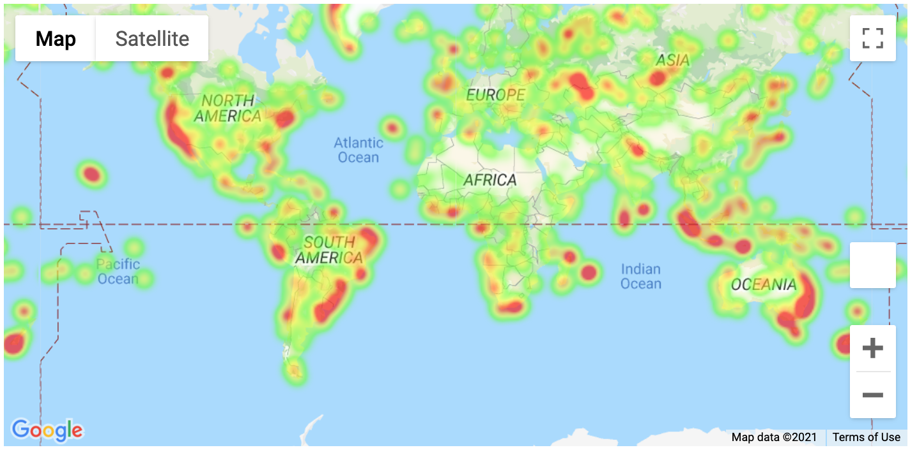
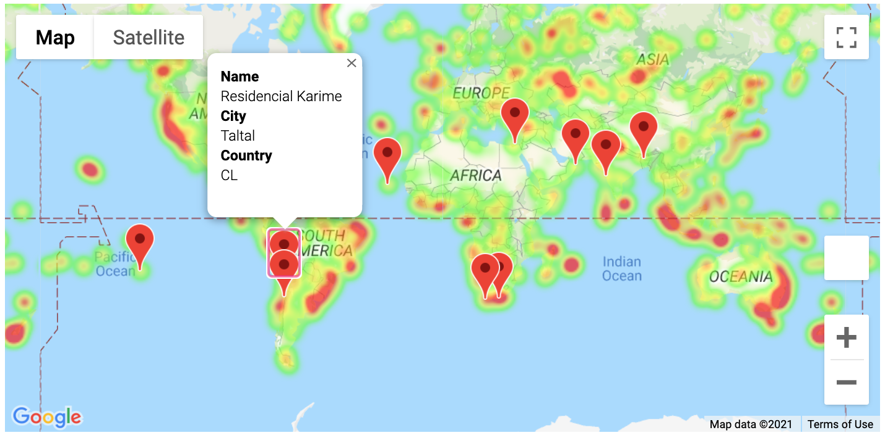

# Python API Challenge 🌡️
Answering the question: "What's the weather like as we approach the equator?"

## Description
This project contains two sections with Python scripts in Jupyter Notebooks, [WeatherPy](WeatherPy) & [VacationPy](VacationPy).

## Tools
* [Jupyter Notebook](https://jupyter.org/) - Web application that allows you to create and share documents that contain live code, equations, visualizations and narrative text
* [Pandas](https://pandas.pydata.org/) - Python library for data manipulation and analysis
* [Matplotlib](https://matplotlib.org/) - Python library for creating data visualizations
* [SciPy](https://www.scipy.org/) - Python library for scientific and technical computing
* [citipy](https://github.com/wingchen/citipy) - Python library for looking up city names with geo-coordinates
* [OpenWeatherMap API](https://openweathermap.org/api) - Service that provides current weather data, forecasts, nowcasts and historical weather data for any geographical location
* [Google Maps JavaScript API](https://developers.google.com/maps/documentation/javascript/overview) - Service for customizing and displaying Google Maps on web pages and mobile devices
* [Google Maps Places API](https://developers.google.com/maps/documentation/places/web-service/overview) - Service for retreiving data on establishments, geographic locations, and prominent points of interest
* [jupyter-gmaps](https://jupyter-gmaps.readthedocs.io/en/latest/) - Jupyter plugin for embedding Google maps in Jupyter notebooks

## WeatherPy ☁️
This section uses randomly generated latitudes and longitudes to  get a list of over 600 cities from around the world using the [Citipy Library](https://github.com/wingchen/citipy). The script then makes calls to the [OpenWeatherMap API](https://openweathermap.org/api) the get the current weather for each city, storying the data in a [Pandas](https://pandas.pydata.org/) [DataFrame](https://pandas.pydata.org/docs/reference/api/pandas.DataFrame.html) and exporting the data to [city_weather.csv](WeatherPy/output/city_weather.csv).

Once the data is gathered, a series of scatter plots are generated to showcase relationships between latitude and various weather attributes:
* [Temperature (F) vs. Latitude](WeatherPy/output/fig1.png)
* [Humidity (%) vs. Latitude](WeatherPy/output/fig2.png)
* [Cloudiness (%) vs. Latitude](WeatherPy/output/fig3.png)
* [Wind Speed (mph) vs. Latitude](WeatherPy/output/fig4.png)

Additional scatterplots are generated to show weather trends in cities separated by hemisphere, and linear regression models are calculated and applied to the plots.

#### Analysis/Observations 📈
* The temperature of cities seems to increase the closer they are to the Equator and decrease the futher they are.
* There does not seem to be a correlation between humidity and latitude. However, cities with the lowest humidity (below 20%) seem to be clustered around 20 degree latitude.
* There does not appear to be any correlation between cloudiness and latitude.
* There does not appear to be any correlation between wind speed and latitude.

## VacationPy ✈️
This section uses the city data gathered in `WeatherPy` to display a heatmap using the humidity percentages of each city.

The city data is then narrowed down to include only cities that match the criteria below:
* Max temperature lower than 80F and higher than 70F
* Wind speed less than 10mph
* Zero % cloudiness

With this new filtered dataset, calls are made to the [Google Maps Places API](https://developers.google.com/maps/documentation/places/web-service/overview) to find the nearest hotel to each city within a 5000 meter radius. A plot for each hotel is added to the heatmap, and clicking on a plot displays the hotel name, city, and country.

